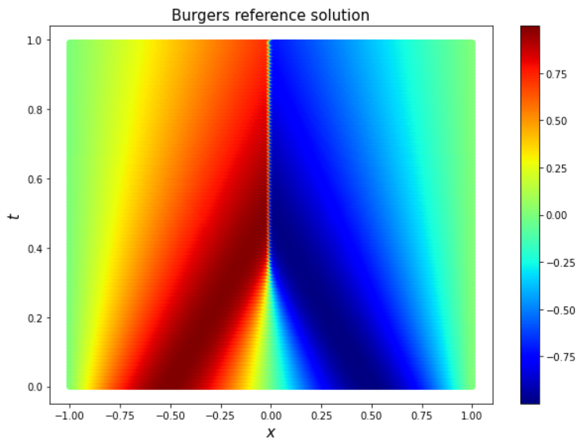
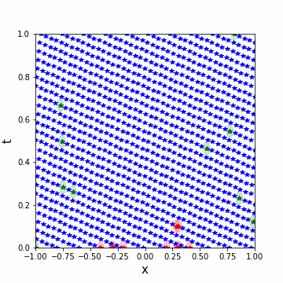

# FBOAL
Fixed-Burget Online Adaptive Learning (FBOAL) for Physics-Informed Neural Networks (PINNs)

The data and code for the paper [Nguyen, T. N. K., Dairay, T., Meunier, R., Millet, C., & Mougeot, M. (2022). Fixed-budget online adaptive learning for physics-informed neural networks. Towards parameterized problem inference. arXiv preprint arXiv:2212.11776.](https://arxiv.org/pdf/2212.11776.pdf).

## Basic usage
We provide a package for calling PINNs model with (or without) adaptive sampling methods (FBOAL, RARD, RAD).
```
model = PINNs(param_pde, X_domain, X_colloc, w_pde, net_transform, net_pde_user, layers, lr, thres,
                 X_bc=None, u_bc=None, X_init=None, u_init=None, X_data=None, u_data=None,
                 X_other=None, u_other=None, net_other=None,X_test=None, u_test=None,
                 resampling=None, period=None, save_colloc=False,
                 m_FBOAML=None, square_side_FBOAML=None, k_RAD=None, c_RAD=None, k_RARD=None, c_RARD=None, m_RARD=None)
```
#### Example on Burgers equation
We take an example on Burgers equation and consider the non-parametric case (i.e. the parameter of the PDE is fixed):

 
First, we define the PDE:
```
def f_user(X_f, nu, model_nn):
    x_temp = X_f[:, 0:1]
    t_temp = X_f[:, 1:2]
    nu_temp = nu
    with tf.GradientTape(persistent=True) as tape:
        tape.watch(x_temp)
        tape.watch(t_temp)

        X_temp = tf.concat([x_temp, t_temp], axis=1)
        u = net_transform(X_temp, model_nn)
        u_x = tape.gradient(u, x_temp)
        u_xx = tape.gradient(u_x, x_temp)
        u_t = tape.gradient(u, t_temp)

    f = u_t + u * u_x - nu_temp * u_xx
    return f
```
where `net_transform` is a function to transform the output of the neural networks so that it sastisfies some conditions. For example, to force the BC/IC to be automatically sastified:
```
def net_transform(X_f, model_nn):
    return model_nn(X_f)[:, 0:1] * X_f[:, 1:2] * (X_f[:, 0:1] + 1) * (X_f[:, 0:1] - 1) - tf.math.sin(pi * X_f[:, 0:1])
```
Then we define the supervised points (optional) and initialize the collocation points and call PINNs:
```
model = PINNs(nu_train, X_star, X_colloc_train, w_pde, net_transform, f_user,
                         layers, lr, thres, X_test=X_test, u_test=u_test,
                 resampling='FBOAML', period=1000, save_colloc=False, m_FBOAML=10, square_side_FBOAML=0.2)
model.train(max_epochs=5000)
```


For the parametric case where the PDE parameter is considered as an input of PINNs, the syntax remains the same with little modification in the `f_user` as now `nu_temp=X_f[:, 2:3]`
## Code
In non-parameterized case:
- [Burgers’ equation](example/non-parameterized/burgers)
- [Wave equation](example/non-parameterized/wave)

In parameterized case:
- [Burgers’ equation](example/parameterized/burgers)
- [Wave equation](example/parameterized/wave)

## Cite this work

If you use the method or code for academic research, you are encouraged to cite the following paper:

```
@article{nguyen2022fixed,
  title={Fixed-budget online adaptive learning for physics-informed neural networks. Towards parameterized problem inference},
  author={Nguyen, Thi Nguyen Khoa and Dairay, Thibault and Meunier, Rapha{\"e}l and Millet, Christophe and Mougeot, Mathilde},
  journal={arXiv preprint arXiv:2212.11776},
  year={2022}
}
```